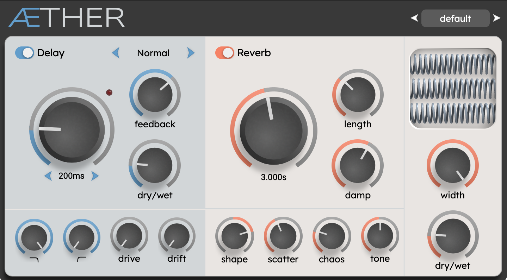

[](https://github.com/smiarx/aether/actions/workflows/cmake-multi-platform.yml)



ÆTHER
=====

ÆTHER is a delay and reverb plugin. The delay is based on tape-delay
mechanisms, while the reverb is inspired by (but not limited to) spring
reverbs.

It is designed for a variety of applications, from subtle spring-reverb guitar
tones to dreamy synth pads, as well as dub-style snare sounds.

[See quick demo on youtube](https://www.youtube.com/watch?v=IVb2rDe2hM4)

## Downloads

The plugin is available in VST, AU and LV2 format on the [release page](https://github.com/smiarx/aether/releases)

## Building

To build ÆTHER, you need CMake:

```bash
# Clone the repository and update submodules
$ git clone https://github.com/smiarx/aether.git
$ cd aether
$ git submodule update --init --recursive

# build
$ cmake -Bbuild -DCMAKE_BUILD_TYPE=Release .
$ cmake --build build --config Release --parallel 4
```

VST will be located in `build/Aether_artifacts/Release`.

You can also build with `-march=native` to build specifically for you machine.

```bash
$ cmake -Bbuild -DCMAKE_BUILD_TYPE=Release -DCMAKE_CXX_FLAGS="-march=native" .
$ cmake --build build --config Release --parallel 4
```

## Fonts

- [Roboto](https://fonts.google.com/specimen/Roboto)
- [Nunito](https://fonts.google.com/specimen/Nunito)
- [Lexend](https://fonts.google.com/specimen/Lexend)
