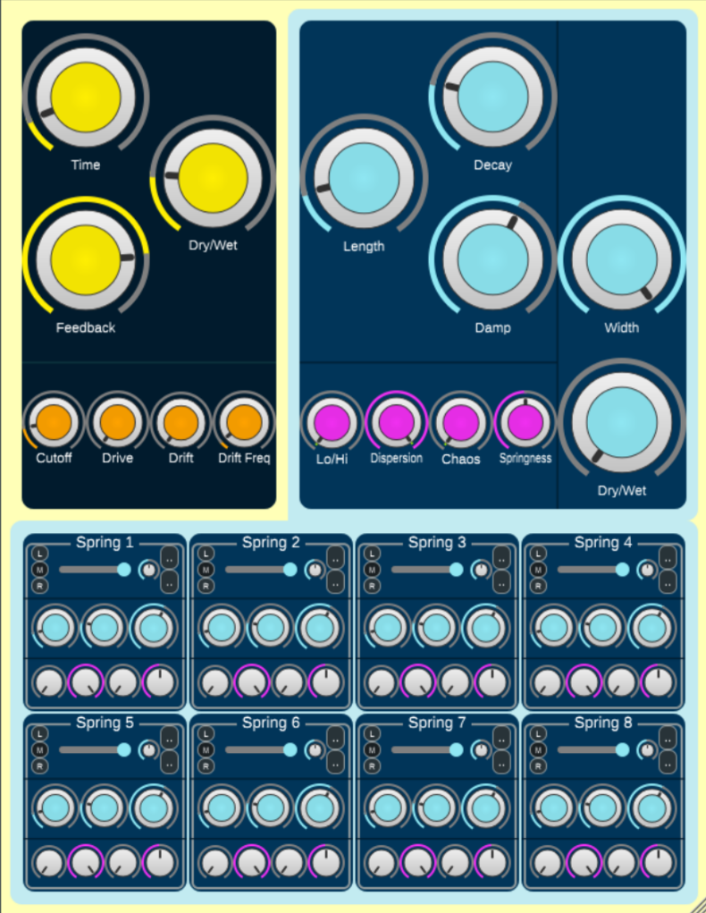

ÆTHER
=====

ÆTHER is a delay and reverb plugin. The delay is based on tape delay
mechanisms. The reverb part is based on (but not restricted to) spring reverbs.

It is designed for a variety of applications, from subtle spring reverbed
guitars to dreamy synth pads as well as as dub styled snare sounds.

## Downloads

The plugin is still in developping phase, but binaries for windows,macOS and
linux will be distributed as soon as a first stable release is available.

## Building

To build ÆTHER, CMake is needed:

```bash
# Clone the repository and update submodules
$ git clone https://github.com/smiarx/aether.git
$ cd aether
$ git submodule update --init --recursive

# build
$ cmake -Bbuild -DCMAKE_BUILD_TYPE=Release .
$ cmake --build build --config Release --parallel 4
```

VST will be located in `build/Aether_artifacts/Release`.

You can also build with `-march=native` to build specifically for you machine.

```bash
$ cmake -Bbuild -DCMAKE_BUILD_TYPE=Release -DCMAKE_CXX_FLAGS="-march=native" .
$ cmake --build build --config Release --parallel 4
```

### Fonts

- [Roboto](https://fonts.google.com/specimen/Roboto)
- [Nunito](https://fonts.google.com/specimen/Nunito)
- [Lexend](https://fonts.google.com/specimen/Lexend)
